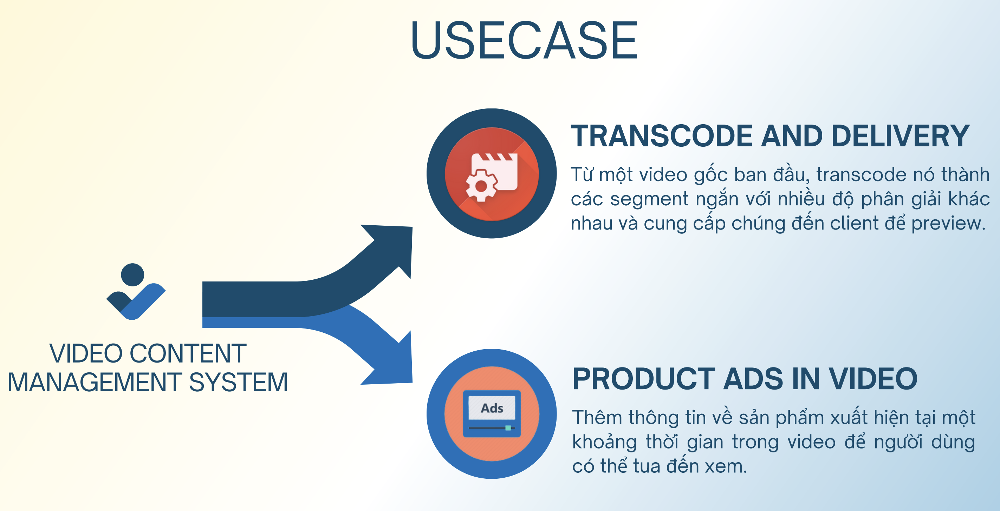

# TERA VCMS - Video Content Management System

## Repositories 🔥

- [Backend Service](https://github.com/phuocleoceo/tera-vcms-be)
- [Frontend Web App](https://github.com/ndtuan7921/tera-training-vcms-fe)

## Contributor 🌟

<table>
  <tr>
    <td align="center"> <b>Truong Minh Phuoc</b><a href="https://github.com/phuocleoceo" title="Backend Dev & Ops">💻🛠</a>
    <td align="center"> <b>Nguyen Dinh Tuan</b><a href="https://github.com/ndtuan7921" title="Frontend Dev">💻</a>
  </tr>

</table>

## Detail

Check `Tera VCMS.pdf`

## Use Case ️🎨

